# Practicum System Unified Functional Flowchart

This is one connected Mermaid flowchart for the full OJT/practicum system. It connects admin setup, account creation, role login gates, coordinator enrollment, student onboarding, pre-deployment review, partner deployment/orientation, OJT start, reports, completion, and evaluation in one continuous flow.

Copy everything inside the Mermaid block into a Mermaid renderer.

```mermaid
flowchart TD
    %% =========================================================
    %% GLOBAL ENTRY + ROLE POLYMORPHIC ACCESS GATES
    %% =========================================================
    START([System Start]) --> LOGIN[User opens system and logs in]
    LOGIN --> AUTH{Valid and active account?}
    AUTH -- No --> LOGIN_ERROR[Show login error]
    LOGIN_ERROR --> LOGIN
    AUTH -- Yes --> ROLE{Resolve user role}

    ROLE -- Admin --> ADMIN_DASH[Admin Dashboard]
    ROLE -- Coordinator --> TEMP_GATE_COORD{Temporary password?}
    ROLE -- Industry Partner --> TEMP_GATE_PARTNER{Temporary password?}
    ROLE -- Student --> TEMP_GATE_STUDENT{Temporary password?}

    TEMP_GATE_COORD -- Yes --> CHANGE_PASSWORD[Forced Change Password]
    TEMP_GATE_PARTNER -- Yes --> CHANGE_PASSWORD
    TEMP_GATE_STUDENT -- Yes --> CHANGE_PASSWORD
    CHANGE_PASSWORD --> PASSWORD_SAVED[Save new password<br/>password_changed = 1]
    PASSWORD_SAVED --> ROLE

    TEMP_GATE_COORD -- No --> COORD_DASH[Coordinator Dashboard]
    TEMP_GATE_PARTNER -- No --> PARTNER_DASH[Partner Dashboard]
    TEMP_GATE_STUDENT -- No --> PROFILE_GATE{Student profile complete?}
    PROFILE_GATE -- No --> STUDENT_PROFILE[Complete Basic Resume Profile<br/>Full name, photo, address, contact number,<br/>emergency contact, guardian info,<br/>course/year/section, student ID]
    STUDENT_PROFILE --> PROFILE_VALIDATE{All required profile fields valid?}
    PROFILE_VALIDATE -- No --> STUDENT_PROFILE_ERROR[Show validation errors]
    STUDENT_PROFILE_ERROR --> STUDENT_PROFILE
    PROFILE_VALIDATE -- Yes --> PROFILE_SAVED[Save profile<br/>profile_completed = 1]
    PROFILE_SAVED --> STUDENT_DASH[Student Dashboard Unlocked]
    PROFILE_GATE -- Yes --> STUDENT_DASH

    %% =========================================================
    %% ADMIN: PROGRAMS, COORDINATORS, PARTNER ACCOUNTS
    %% =========================================================
    ADMIN_DASH --> ADMIN_ACTION{Admin action}

    ADMIN_ACTION -- Manage Programs --> PROGRAM_FORM[Program / Course Management]
    PROGRAM_FORM --> PROGRAM_INPUT[Enter program code, name, required OJT hours]
    PROGRAM_INPUT --> PROGRAM_VALID{Program data valid?}
    PROGRAM_VALID -- No --> PROGRAM_ERROR[Show program validation error]
    PROGRAM_ERROR --> PROGRAM_FORM
    PROGRAM_VALID -- Yes --> PROGRAM_SAVE[Create/update program]
    PROGRAM_SAVE --> PROGRAM_ACTIVE{Program active?}
    PROGRAM_ACTIVE -- Yes --> PROGRAM_AVAILABLE[Program appears in partner accepted-program checklist]
    PROGRAM_ACTIVE -- No --> PROGRAM_INACTIVE[Program stored but hidden from new partner checklist]
    PROGRAM_AVAILABLE --> ADMIN_DASH
    PROGRAM_INACTIVE --> ADMIN_DASH

    ADMIN_ACTION -- Create Coordinator --> COORD_FORM[Coordinator Account Form]
    COORD_FORM --> COORD_INPUT[Enter name, email, department]
    COORD_INPUT --> COORD_VALID{Coordinator data valid?}
    COORD_VALID -- No --> COORD_ERROR[Show coordinator validation error]
    COORD_ERROR --> COORD_FORM
    COORD_VALID -- Yes --> COORD_CREATE[Create coordinator account<br/>role = coordinator<br/>password_changed = 0]
    COORD_CREATE --> COORD_CREDENTIAL_EMAIL[Email username and temporary password<br/>Require password change on first login]
    COORD_CREDENTIAL_EMAIL --> COORD_FIRST_LOGIN[Coordinator receives credentials]
    COORD_FIRST_LOGIN --> LOGIN

    ADMIN_ACTION -- Create Industry Partner --> PARTNER_FORM[Industry Partner Registration]
    PARTNER_FORM --> PROGRAM_CHECK{Active programs exist?}
    PROGRAM_CHECK -- No --> PARTNER_BLOCKED[Create programs/courses first]
    PARTNER_BLOCKED --> PROGRAM_FORM
    PROGRAM_CHECK -- Yes --> PARTNER_INPUT[Enter company name, contact person,<br/>email, contact number, address]
    PARTNER_INPUT --> PARTNER_PROGRAMS[Select accepted programs/courses checklist]
    PARTNER_PROGRAMS --> PARTNER_VALID{Partner data valid and<br/>at least one program selected?}
    PARTNER_VALID -- No --> PARTNER_ERROR[Show partner validation error]
    PARTNER_ERROR --> PARTNER_FORM
    PARTNER_VALID -- Yes --> PARTNER_CREATE[Create partner user and partner company<br/>Sync accepted programs<br/>password_changed = 0]
    PARTNER_CREATE --> PARTNER_CREDENTIAL_EMAIL[Email partner username and temporary password<br/>Require password change on first login]
    PARTNER_CREDENTIAL_EMAIL --> PARTNER_FIRST_LOGIN[Partner receives credentials]
    PARTNER_FIRST_LOGIN --> LOGIN

    %% =========================================================
    %% COORDINATOR: STUDENT CREATION + ENROLLMENT
    %% =========================================================
    COORD_DASH --> COORD_ACTION{Coordinator action}

    COORD_ACTION -- Create Student --> STUDENT_CREATE_FORM[Create Student from COR]
    STUDENT_CREATE_FORM --> STUDENT_CREATE_INPUT[Enter student number, name, email,<br/>program, year level, section, COR]
    STUDENT_CREATE_INPUT --> STUDENT_CREATE_VALID{Student data and COR valid?}
    STUDENT_CREATE_VALID -- No --> STUDENT_CREATE_ERROR[Show student creation error]
    STUDENT_CREATE_ERROR --> STUDENT_CREATE_FORM
    STUDENT_CREATE_VALID -- Yes --> STUDENT_ACCOUNT[Create student user and student record<br/>No enrollment email yet]
    STUDENT_ACCOUNT --> COORD_DASH

    COORD_ACTION -- Enroll Student --> ENROLL_FORM[Student OJT Enrollment Wizard]
    ENROLL_FORM --> SELECT_STUDENT[Select student]
    SELECT_STUDENT --> STUDENT_PROGRAM{Student has valid program?}
    STUDENT_PROGRAM -- No --> ENROLL_ERROR1[Stop enrollment: assign valid program/course]
    ENROLL_ERROR1 --> ENROLL_FORM
    STUDENT_PROGRAM -- Yes --> SELECT_COMPANY[Select partner company<br/>filtered by accepted programs]
    SELECT_COMPANY --> COMPANY_ACCEPTS{Company accepts student's program?}
    COMPANY_ACCEPTS -- No --> ENROLL_ERROR2[Stop enrollment: company unavailable for program]
    ENROLL_ERROR2 --> SELECT_COMPANY
    COMPANY_ACCEPTS -- Yes --> TERM_INPUT[Enter academic term,<br/>term start date, term end date]
    TERM_INPUT --> ENROLL_SAVE[Create/update enrollment<br/>status = pending<br/>predeployment_status = not_submitted<br/>required_hours from program<br/>official OJT dates blank]
    ENROLL_SAVE --> STUDENT_TEMP_PASSWORD[Generate/reset student temporary password<br/>password_changed = 0]
    STUDENT_TEMP_PASSWORD --> STUDENT_ENROLLMENT_EMAIL[Email student enrollment confirmation<br/>academic term, term dates,<br/>username, temporary password, IP warning]
    STUDENT_ENROLLMENT_EMAIL --> STUDENT_FIRST_LOGIN[Student receives email]
    STUDENT_FIRST_LOGIN --> LOGIN

    %% =========================================================
    %% STUDENT: DASHBOARD + PRE-DEPLOYMENT REQUIREMENTS
    %% =========================================================
    STUDENT_DASH --> PREDEP_CHECKLIST[Dashboard shows Pre-Deployment Requirements Checklist]
    PREDEP_CHECKLIST --> ENROLLMENT_EXISTS{Student is enrolled?}
    ENROLLMENT_EXISTS -- No --> PREDEP_LOCKED[Uploads and Submit for Review locked<br/>Wait for coordinator enrollment]
    PREDEP_LOCKED --> STUDENT_DASH
    ENROLLMENT_EXISTS -- Yes --> UPLOAD_REQUIREMENTS[Upload five requirements<br/>Parent/Guardian Consent, PhilHealth,<br/>Vaccine Card, Guardian Valid ID, COR]
    UPLOAD_REQUIREMENTS --> FILE_VALID{Each file valid PDF/JPG/PNG and <= limit?}
    FILE_VALID -- No --> FILE_ERROR[Show upload error]
    FILE_ERROR --> UPLOAD_REQUIREMENTS
    FILE_VALID -- Yes --> REQUIREMENT_SAVED[Save requirement file<br/>status = uploaded]
    REQUIREMENT_SAVED --> ALL_REQS_UPLOADED{All five requirements uploaded?}
    ALL_REQS_UPLOADED -- No --> UPLOAD_REQUIREMENTS
    ALL_REQS_UPLOADED -- Yes --> SUBMIT_REVIEW[Student clicks Submit for Review]
    SUBMIT_REVIEW --> SUBMIT_ALLOWED{predeployment_status allows submission?}
    SUBMIT_ALLOWED -- No --> SUBMIT_BLOCKED[Prevent duplicate or invalid submission]
    SUBMIT_BLOCKED --> PREDEP_CHECKLIST
    SUBMIT_ALLOWED -- Yes --> STATUS_SUBMITTED[predeployment_status = submitted]
    STATUS_SUBMITTED --> NOTIFY_COORD_REVIEW[Notify coordinator: review requested]

    %% =========================================================
    %% COORDINATOR: REVIEW + ENDORSEMENT + FORWARDING
    %% =========================================================
    NOTIFY_COORD_REVIEW --> COORD_REVIEW[Coordinator opens My Students and reviews uploads]
    COORD_REVIEW --> REVIEW_UNLOCKED{Status submitted / needs_revision / approved?}
    REVIEW_UNLOCKED -- No --> REVIEW_LOCKED[Review locked until student submits]
    REVIEW_LOCKED --> COORD_DASH
    REVIEW_UNLOCKED -- Yes --> REVIEW_DOCS[Approve or reject each uploaded document]
    REVIEW_DOCS --> REVIEW_DECISION{All documents approved?}

    REVIEW_DECISION -- No --> REJECT_DOC[Reject file with review note]
    REJECT_DOC --> STATUS_NEEDS_REVISION[predeployment_status = needs_revision]
    STATUS_NEEDS_REVISION --> NOTIFY_STUDENT_REVISION[Notify student: requirement needs revision]
    NOTIFY_STUDENT_REVISION --> STUDENT_REPLACE[Student replaces only rejected file]
    STUDENT_REPLACE --> REQUIREMENT_SAVED

    REVIEW_DECISION -- Yes --> STATUS_APPROVED[predeployment_status = approved]
    STATUS_APPROVED --> NOTIFY_STUDENT_APPROVED[Notify student: all requirements approved]
    NOTIFY_STUDENT_APPROVED --> ENDORSEMENT_CHOICE{Endorsement letter option}
    ENDORSEMENT_CHOICE -- Upload --> UPLOAD_ENDORSEMENT[Coordinator uploads endorsement letter]
    ENDORSEMENT_CHOICE -- Auto-generate --> GENERATE_ENDORSEMENT[System generates endorsement letter]
    UPLOAD_ENDORSEMENT --> ENDORSEMENT_READY[Endorsement ready]
    GENERATE_ENDORSEMENT --> ENDORSEMENT_READY
    ENDORSEMENT_READY --> FORWARD_DOCUMENTS[Forward student uploads + endorsement to partner]
    FORWARD_DOCUMENTS --> STATUS_FORWARDED[predeployment_status = forwarded]
    STATUS_FORWARDED --> PARTNER_DEPLOYMENT_EMAIL[Email partner deployment documents with attachments]
    PARTNER_DEPLOYMENT_EMAIL --> NOTIFY_PARTNER_DEPLOYMENT[System notification to partner]

    %% =========================================================
    %% PARTNER: DOCUMENT REVIEW + ACCEPTANCE + ORIENTATION
    %% =========================================================
    NOTIFY_PARTNER_DEPLOYMENT --> PARTNER_REVIEW[Partner reviews forwarded documents]
    PARTNER_REVIEW --> ACCEPT_DECISION{Partner accepts deployment?}
    ACCEPT_DECISION -- No / keep reviewing --> PARTNER_REVIEW
    ACCEPT_DECISION -- Yes --> ACCEPT_GUARD{predeployment_status = forwarded?}
    ACCEPT_GUARD -- No --> ACCEPT_BLOCKED[Accept blocked by invalid status]
    ACCEPT_BLOCKED --> PARTNER_DASH
    ACCEPT_GUARD -- Yes --> STATUS_ACCEPTED[predeployment_status = accepted]
    STATUS_ACCEPTED --> NOTIFY_ACCEPTED[Notify student and coordinator:<br/>deployment accepted]

    NOTIFY_ACCEPTED --> ORIENTATION_ACTION{Partner orientation action}
    ORIENTATION_ACTION -- Send email only --> ORIENTATION_EMAIL_GUARD{Status accepted or scheduled?}
    ORIENTATION_EMAIL_GUARD -- No --> ORIENTATION_EMAIL_BLOCKED[Orientation email blocked]
    ORIENTATION_EMAIL_BLOCKED --> PARTNER_DASH
    ORIENTATION_EMAIL_GUARD -- Yes --> SEND_ORIENTATION_EMAIL[Send orientation instructions email]
    SEND_ORIENTATION_EMAIL --> NOTIFY_ORIENTATION_EMAIL[Notify student and coordinator]
    NOTIFY_ORIENTATION_EMAIL --> ORIENTATION_ACTION

    ORIENTATION_ACTION -- Set orientation date/time --> SCHEDULE_GUARD{Status accepted or scheduled?}
    SCHEDULE_GUARD -- No --> SCHEDULE_BLOCKED[Schedule blocked]
    SCHEDULE_BLOCKED --> PARTNER_DASH
    SCHEDULE_GUARD -- Yes --> ORIENTATION_DATETIME[Enter valid future orientation date/time and notes]
    ORIENTATION_DATETIME --> STATUS_ORIENTATION_SCHEDULED[predeployment_status = orientation_scheduled]
    STATUS_ORIENTATION_SCHEDULED --> ORIENTATION_NOTICE[Email and notify student/coordinator of schedule]

    %% =========================================================
    %% PARTNER: COMPLETE ORIENTATION + OFFICIAL OJT START
    %% =========================================================
    ORIENTATION_NOTICE --> ORIENTATION_DONE[Orientation happens]
    ORIENTATION_DONE --> COMPLETE_ORIENTATION[Partner marks orientation completed]
    COMPLETE_ORIENTATION --> COMPLETE_GUARD{predeployment_status = orientation_scheduled?}
    COMPLETE_GUARD -- No --> COMPLETE_BLOCKED[Completion blocked]
    COMPLETE_BLOCKED --> PARTNER_DASH
    COMPLETE_GUARD -- Yes --> OFFICIAL_DATES[Set official OJT start date and projected end date<br/>Auto-calculate projected end if blank]
    OFFICIAL_DATES --> DATE_VALID{Official/projected dates valid?}
    DATE_VALID -- No --> DATE_ERROR[Show date validation error]
    DATE_ERROR --> OFFICIAL_DATES
    DATE_VALID -- Yes --> STATUS_ORIENTATION_COMPLETED[predeployment_status = orientation_completed<br/>enrollment status = active<br/>official_start_date and projected_end_date saved]
    STATUS_ORIENTATION_COMPLETED --> OJT_STARTED_EMAIL[Email student and coordinator<br/>official start date, projected end date, required hours]
    OJT_STARTED_EMAIL --> NOTIFY_OJT_STARTED[System notification:<br/>OJT officially started]

    %% =========================================================
    %% STUDENT: REPORTING, HOURS, COMPLETION
    %% =========================================================
    NOTIFY_OJT_STARTED --> REPORT_GATE{Today >= official OJT start date?}
    REPORT_GATE -- No --> REPORT_LOCKED[DTR and weekly reports locked until official start]
    REPORT_LOCKED --> REPORT_GATE
    REPORT_GATE -- Yes --> REPORTS_UNLOCKED[DTR and weekly PDF reports unlocked]
    REPORTS_UNLOCKED --> STUDENT_REPORT_ACTION{Student report action}

    STUDENT_REPORT_ACTION -- Submit DTR --> DTR_FORM[Enter work date, time in, time out, tasks done]
    DTR_FORM --> DTR_VALID{DTR valid?<br/>No future date<br/>Not before official start<br/>No duplicate date<br/>Tasks required}
    DTR_VALID -- No --> DTR_ERROR[Show DTR validation error]
    DTR_ERROR --> DTR_FORM
    DTR_VALID -- Yes --> SAVE_DTR[Save DTR and computed hours]
    SAVE_DTR --> SYNC_HOURS[Sync rendered hours]

    STUDENT_REPORT_ACTION -- Submit Weekly Report --> WEEKLY_FORM[Enter week number and PDF report]
    WEEKLY_FORM --> WEEKLY_VALID{Weekly report valid?<br/>PDF required<br/>No duplicate week}
    WEEKLY_VALID -- No --> WEEKLY_ERROR[Show weekly report error]
    WEEKLY_ERROR --> WEEKLY_FORM
    WEEKLY_VALID -- Yes --> SAVE_WEEKLY[Save weekly report]
    SAVE_WEEKLY --> REPORTS_UNLOCKED

    SYNC_HOURS --> HOURS_DECISION{Rendered hours >= required hours?}
    HOURS_DECISION -- No --> REPORTS_UNLOCKED
    HOURS_DECISION -- Yes --> STATUS_COMPLETED[Enrollment status = completed]

    %% =========================================================
    %% PARTNER: FINAL EVALUATION + END
    %% =========================================================
    STATUS_COMPLETED --> EVAL_AVAILABLE[Final evaluation available to partner]
    STATUS_ORIENTATION_COMPLETED --> EVAL_AVAILABLE
    EVAL_AVAILABLE --> EVAL_GUARD{Orientation completed?}
    EVAL_GUARD -- No --> EVAL_BLOCKED[Evaluation locked]
    EVAL_BLOCKED --> PARTNER_DASH
    EVAL_GUARD -- Yes --> PARTNER_EVALUATION[Partner submits final evaluation<br/>Rating 1-5 and comments]
    PARTNER_EVALUATION --> EVAL_VALID{Evaluation valid?}
    EVAL_VALID -- No --> EVAL_ERROR[Show evaluation error]
    EVAL_ERROR --> PARTNER_EVALUATION
    EVAL_VALID -- Yes --> EVAL_SAVED[Save/update evaluation]
    EVAL_SAVED --> END([Functional System Flow Complete])

    %% =========================================================
    %% STATUS THREAD INSIDE SAME CONNECTED DIAGRAM
    %% =========================================================
    ENROLL_SAVE -. creates .-> STATUS_NOT_SUBMITTED_LABEL[not_submitted]
    STATUS_NOT_SUBMITTED_LABEL -. submit .-> STATUS_SUBMITTED
    STATUS_SUBMITTED -. reject .-> STATUS_NEEDS_REVISION
    STATUS_NEEDS_REVISION -. replace and resubmit .-> STATUS_SUBMITTED
    STATUS_SUBMITTED -. approve all .-> STATUS_APPROVED
    STATUS_APPROVED -. forward .-> STATUS_FORWARDED
    STATUS_FORWARDED -. accept .-> STATUS_ACCEPTED
    STATUS_ACCEPTED -. schedule .-> STATUS_ORIENTATION_SCHEDULED
    STATUS_ORIENTATION_SCHEDULED -. complete .-> STATUS_ORIENTATION_COMPLETED
```

## Notes

- This is now one connected diagram instead of separate flowcharts.
- The role login section behaves like a polymorphic access gate: one login flow routes to different role behaviors depending on account role and state.
- Pre-deployment status transitions are connected inside the same main diagram.
